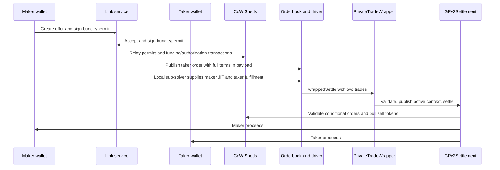

# Private trades assessment

Reviewed on 2026-09-14 against `e0069ce17f0bd4d9149309bccde6da592597d9ca`.

## Verdict

Continue the project as a focused ERC20 bilateral settlement product. Do not release this implementation with real funds yet. The app demonstrates an important flow, but two reproduced contract defects invalidate its claims of exact, single-use settlement. The service also has reproducible cross-offer payload confusion and false settlement reporting.

The strongest product is a link that lets two known parties execute an agreed swap, inspect readable terms, cancel before execution, and recover cleanly from failure. CoW integration can provide distribution and familiar infrastructure. It does not automatically provide privacy, a business model, or permission to bypass auction rules.

This is a concept, implementation, and release review, not an external security audit. Application code remains unchanged. The accompanying counterexamples are executable review artifacts, not fixes.

## Recovered intent and resume point

The requested Pi session `01a091d9-6c68-72c8-b0bc-076186568301` was a read-only CoW Shed reconnaissance child. The full implementation continued in parent `01a091be-b691-71bb-b201-e55831b10b36`. Its last completed milestone was the browser-driven create, sign, share, accept, settle, and receipt flow at `e0069ce`.

The parent transcript establishes these decisions:

1. The original pasted RFC required exact ERC20 amounts, expiry, optional enforced counterparty restriction, links, atomic execution, and cancellation. It excluded a public orderbook and solver competition.
2. The user corrected an initial implementation based on an obsolete wrapper interface. The implementation moved to the documented `CowWrapper` Atomic Bundle framework.
3. After reiterating the no-orderbook premise, the user explicitly approved validating JIT plus fulfillment first. The current driver experiment was authorized. That approval does not prove that it satisfies the original privacy promise.
4. The user requested permits, direct wallet proceeds, and an on-chain beneficiary check. Those are implemented. The user also stated that nothing was in production and API changes were acceptable.
5. The last requested deliverable was the full app flow, with mobile explicitly excluded. Rabby compatibility and payload consistency were suggested next steps, not selected release requirements.

Evidence is in the project-local Pi parent transcript at lines 7, 194, 609, 626, 877, 1321, 1783, 1897, 1977, and 2078. The child transcript is under that session's `ffa9e5be-8903-4a85-8eee-7b161cb05105/run-0/session.jsonl`. Credentials and wallet payloads from the history are deliberately absent from this report.

## Concept and premises

The public [Private Trade Links proposal](https://forum.cow.fi/t/private-trade-links/3558) describes negotiated bilateral exchange rather than price discovery. That is a coherent, bounded use case. The current app is closest to a tool for known counterparties trading standard ERC20s on one EVM chain.

The concept is not technically novel merely because settlement is atomic. For example, [0x documents RFQ fills, taker restrictions, expiry, and cancellation](https://docs.0xprotocol.org/en/latest/basics/functions.html). The product must earn its complexity through a better agreement-to-settlement experience, CoW distribution, or useful integration into existing workflows. There is no demand, retention, or willingness-to-pay evidence in this repository. Commercial viability remains a hypothesis.

“Private” needs a precise definition. A restricted counterparty is an authorization property. Confidential pre-trade terms are a data-disclosure property. On-chain settlement exposes calldata and transfers. This code can enforce the former; its current orderbook route does not provide the latter.

The broader game-item premise needs revision. An EVM transaction cannot atomically transfer an item controlled by an unrelated off-chain game server without an additional custody or trusted coordination mechanism. ERC721 or ERC1155 assets also require a different transfer design from the present ERC20-only, interaction-free settlement. Those are separate products, not additional token entries.

“Gasless” means someone else pays. The current flow can involve two permit transactions, two Shed funding/authorization transactions, then settlement. Some steps disappear when allowances already exist. The historical 309,906-gas driver settlement cited in `JIT-PATH.md` excludes this complete setup cost and predates later changes. It is not a current total-cost benchmark.

Both orders set their minimum proceeds equal to the exact intended execution. That creates no order surplus to finance an ordinary surplus-funded route. A sustainable service needs explicit fees, sponsored gas, or an application subsidy, plus pricing for failed and abandoned attempts. As an illustration, a hypothetical 10-basis-point fee on $100 produces $0.10 before gas and operations. No profitability follows from a successful offline swap.

## What the implementation actually does

The orderbook, autopilot, driver, and custom solver participate in the implemented app path. The service does not call a BYOS proposal API. The optional `PrivateTradeSubmitter` provides a separate direct-submission path at contract level.

| Component | Responsibility | Assessment |
| --- | --- | --- |
| `PrivateTradeLib`, `PrivateTradeBuilder` | Derive orders, conditional authorizations, signatures and settlement encoding | Useful shared implementation, but appData is not fixed by the conditional authorization |
| `PrivateTradeWrapper`, `PrivateTradeOrder` | Enforce paired execution using temporary wrapper context | Sound general mechanism; replay and independent-price defects require remediation |
| CoW Shed, `PrivateTradeAuthoriser` | Owner-signed funding and authorization; enforce own-wallet beneficiary | Valuable protection on the generated bundle path; not a substitute for validating what arbitrary signed calls do |
| `LinkCompute`, `LinkRelay`, link service | Persist offers, compute signatures, relay and report progress | Functional demo architecture; shared scratch files and lifecycle assumptions are unsafe for multiple offers |
| Custom sub-solver and browser app | Produce JIT/fulfillment solutions and collect signatures | Demonstrated locally in prior session; not a completed production BYOS integration |

## Release blockers

### 1. Conditional authorization can execute again under a different appData hash

**Reproduced.** `PrivateTradeOrder._orderFor` accepts the current order's appData when deriving the expected order, so it never fixes appData to an authorized value. The wrapper only checks that both orders agree with each other. GPv2 includes appData in the order digest and tracks fills per order UID.

The counterexample settles a pair, replenishes its balances and allowances, changes both orders' appData, and settles again with the same conditional authorizations. Both recipients receive twice the authorized trade amount across the two executions. It does not require another conditional-order authorization.

Preconditions matter: the repeated transfer requires available funds and allowance. The exact initial funding can temporarily prevent it, but subsequent trades can replenish both. The existing `test_replayReverts` only retries the identical order bytes.

Sources: `src/PrivateTradeOrder.sol:144`, `src/PrivateTradeWrapper.sol:236`, `src/libraries/PrivateTradeBuilder.sol:76`, and `lib/cow-contracts/src/contracts/GPv2Settlement.sol:393`. Proof: `docs/review/ReviewCounterexamples.t.sol`, `test_sameAuthorizationSettlesAgainWithDifferentAppData`.

Required outcome: one authorized offer cannot execute twice, even if appData changes, balances return, approvals are renewed, or another submitter encodes it. Consider explicit consumed-offer state and cancellation semantics, or a rigorously fixed order commitment. Do not rely on depleted allowances as replay protection.

### 2. Taker prices can consume existing settlement funds

**Reproduced.** The driver-compatible token list permits duplicate token addresses at different indices. `_validateSettlement` checks reciprocity using only the maker's indices. GPv2 computes each trade with that trade's own indices.

The counterexample keeps maker execution exact, gives the taker separate token indices and a better price, seeds the settlement with 100 USDC, and completes successfully. The taker receives 200 USDC for an agreement specifying 100 USDC; the settlement's seeded 100 USDC is consumed.

This requires an authenticated submitting path and an existing settlement balance. It does not show that an arbitrary unauthenticated EOA can invoke the wrapper directly. It does refute the wrapper's exactness and buffer-isolation claims.

Sources: `src/PrivateTradeWrapper.sol:268`, `lib/cow-contracts/src/contracts/GPv2Settlement.sol:311`. Proof: `test_takerIndependentPricesSpendSettlementBuffer`.

Required outcome: validate actual executed output for each trade using its own prices, and prove that the pair cannot consume pre-existing protocol balances. Retain duplicate-index compatibility with the driver.

### 3. Relay uses the last computed offer instead of the accepted offer

**Reproduced with an extracted-function test and mocked subprocess/filesystem.** `relay(computed, signatures)` never writes `computed` to the file that `LinkRelay.run` reads. Creating offer B overwrites `out-json/link-computed.json`. Later acceptance of offer A writes A's signatures, then invokes the relay against B's computation.

Signature checks usually turn this into a failure rather than unauthorized payment, but it makes normal multi-offer use unreliable. It needs no simultaneous JavaScript execution. A sequential A-create, B-create, A-accept sequence suffices. Withdrawal computation has a similar globally shared plan file.

Sources: `link-service/server.mjs:113`, `:120`, `:711`; `script/LinkRelay.s.sol:34`; withdrawal paths at `server.mjs:224` and `:620`. Proof: `docs/review/service-counterexamples.mjs`.

Required outcome: immutable per-offer computed payloads and per-attempt files or structured inputs; acceptance and withdrawal must execute exactly the signed plan. Test interleaved offers and restart recovery.

### 4. A balance decrease is reported as settlement

**Reproduced with the real status function and mocked chain/orderbook responses.** `status` reports `settled` whenever the maker Shed's sell-token balance drops below its acceptance baseline. With an open order and no settlement transaction, an unrelated withdrawal produces a successful status. The receipt can then say that a transaction was not found.

Source: `link-service/server.mjs:371`. Proof: `docs/review/service-counterexamples.mjs`.

Required outcome: derive execution from the intended order UID and successful transaction/trade evidence, with explicit pending, cancelled, expired, failed, and confirmation states. Balance changes can supplement evidence, not replace it. A successful transaction and chain finality are also different states.

### 5. Funding, retries, cancellation and open acceptance do not form a complete lifecycle

**Source-verified.** Funding and settlement are different transactions. `LinkRelay.run` performs permits before checking whether bundle nonces were consumed. After an EIP-2612-funded bundle spends its allowance, a retry tries the consumed permit again and fails the allowance check before reaching the nonce skip. An orderbook error after successful funding leaves exactly this recovery problem. The historical submitter retry test exercises a different path and does not prove service retry safety.

An open offer is also not implemented correctly. `LinkCompute._terms` maps a zero taker through `proxyOf(0)` rather than preserving the open-offer sentinel. Acceptance changes the taker and recomputes terms, expiry and salt while retaining the maker's old signature. Even the contract open-offer test chooses the taker before authorizing the maker; it does not prove “maker signs once, unknown taker accepts later.”

There is no cancellation route or UI, despite cancellation being in the original MVP. `ComposableCoW.remove` exists upstream, but the app has not connected revocation, unused signed bundle invalidation, and recovery. Withdrawal is shown only after the UI decides a trade settled, although failed funded offers also need recovery.

Sources: `script/LinkRelay.s.sol:38`, `:64`, `:131`; `link-service/server.mjs:678`, `:683`, `:720`; `script/LinkCompute.s.sol:307`; `link-service/page.mjs:301`; `lib/composable-cow/src/ComposableCoW.sol:150`.

Required outcome: define and test the full lifecycle, including failure after either party funds, orderbook timeout after acceptance, duplicate acceptance, expiry, cancellation racing settlement, service restart, and funds recovery. Keep restricted offers as the first supported mode if open acceptance needs a separate authorization design.

## Additional material gaps

| Area | Finding | Required release evidence |
| --- | --- | --- |
| Confidentiality | Posted taker appData ABI-encodes both parties' terms, including beneficiary wallets. Its ERC-1271 payload also includes full terms. The maker has no separate orderbook entry, but its information is disclosed. Role reads trust an unsigned `address` query. | An explicit threat model and either a private submission path or accurate disclosure to users. See `LinkCompute.s.sol:278`, `PrivateTradeAppData.sol:49`, `server.mjs:554`. |
| Wallet and token support | The app always runs the permit-signing flow. When typed data is unavailable it uses `personal_sign` on a raw permit digest, which adds a different signing envelope. It has no functional approve transaction flow. DAI-style `allowed=true` grants an unlimited allowance, unlike the amount-limited UI description. Contract-owner signatures are restricted by local ECDSA/65-byte handling. | Named supported wallets and token contracts, real permit and approve-path tests, truthful allowance display, chain checks, and a deliberate smart-wallet/Safe story. See `page.mjs:423`, `TokenPermit.sol:97`, `server.mjs:655`. |
| Browser trust | Token symbols and error strings enter `innerHTML` templates without escaping. Arbitrary token metadata can therefore become markup on a signing page. `createChecked` validates the generated helper call; it cannot protect users who sign arbitrary malicious calls from a compromised page. | Render untrusted values as text, validate complete signing requests, and test malicious metadata. See `page.mjs:110`, `:245`, `:256`; `server.mjs:353`. |
| Service robustness | Synchronous Forge/RPC calls block the HTTP process; there is no durable transaction/job state, acceptance lock, robust expiry handling, or bounded operational queue. Offer links use only 40 bits of the offer hash, and repeated identical creation within a block can overwrite an existing record because salt derives from timestamp. Sub-solver solutions all use id `0`. | Multi-offer and restart tests, unique stable IDs, authenticated sensitive reads, bounded resource use, unique solution IDs, and operational limits. See `server.mjs:120`, `:523`; `LinkCompute.s.sol:317`; `private-trade-solver.mjs:81`. |
| Release proof | The app browser test uses development wallets and tests one restricted pair. It checks received balances increased, not exact four-way deltas. CI runs Foundry only. Existing tests are useful but do not cover the reproduced defects. | Exact debit/credit assertions, extension-wallet runs, application regression tests, independent contract review, staging approval, and production configuration evidence. See `scripts/app-e2e.mjs`, `.github/workflows/test.yml`. |

## BYOS and primary-document assessment

The [Atomic Bundle integration guide](https://docs.cow.fi/cow-protocol/integrate/wrappers) supports this project's use of `CowWrapper`, deterministic `validateWrapperData`, staging testing, and eventual audit/DAO approval. The [contract reference](https://docs.cow.fi/cow-protocol/reference/contracts/periphery/wrapper) explicitly warns about untrusted settlement data and intermediate bundles. The last-wrapper check is a good response to that warning. Making the orders invalid outside the wrapper is also stronger than relying on a solver's promise to include it.

Those documents do not make a new bundle production-authorized. Tests impersonate an allowlist manager; that proves execution under test permissions, not staging or DAO approval. The upstream integration example still uses `target` for appData whereas this pinned backend uses `address`. Preserve the proven wire format and pin the compatible services/app-data revisions rather than copying the example blindly.

The [BYOS RFP](https://forum.cow.fi/t/rfp-bring-your-own-solver-byos/3469) concerns permissionless proposals to a bonded operator participating in ordinary CoW auctions. Its no-new-orderbook requirement means BYOS should not operate an additional discovery channel; it does not mean execution bypasses CoW's orderbook.

The adjacent local implementations confirm the integration gap. TypeScript `apps/byos/src/infra/api/solve.ts:216` builds Trampoline interactions and one fee-bearing fulfillment. The Rust equivalent at `crates/byos/src/infra/api/solve.rs:164` builds one fulfillment and no wrappers. The local docs and TypeScript schema are newer than the local Rust schema, so they must not be treated as one synchronized implementation. Reviewed snapshots were TypeScript `9fdfa03`, docs `c67f577`, and Rust `3f5d914`; their current deployed state was not checked.

`PrivateTradeProposal` is a custom proposed schema, not an integrated BYOS feature. Its signature is optional, it does not verify escrow eligibility, and the link path creates unsigned proposals. Its terms hash excludes beneficiaries and the full execution payload. On-chain validation of a successful pair does not establish fair blame for a malformed submission that reverts, and reverted attribution events do not survive. Revert attribution needs a separately specified verifiable record and policy.

The Rust validator at `infra/blockchain/validator.rs:166` rejects proposals whose surplus-based score does not exceed its minimum. A zero-surplus exact pair does not acquire a funding model by being encoded as JIT. The earlier “about one week” BYOS estimate was a historical guess made before full service review; it is not a supported delivery commitment.

## Viable implementation choices

| Direction | Fit | Main cost | Judgment |
| --- | --- | --- | --- |
| Private link service plus agreed direct CoW submission | Closest to no public orderbook/no competition; retain wrapper, handler, Shed and beneficiary work | Approved submitting identity, explicit fees, private transaction delivery policy, recovery and cancellation | Preferred target if the original product promise remains important. Whether BYOS operates it is a separate integration agreement. |
| Current maker-JIT/taker-fulfillment path | Proven driver experiment and useful compatibility test | Public terms, auction economics/policy, conditional-signature infrastructure settings, unfinished BYOS support | Retain as an integration test. Ship only with an explicitly changed product promise and a verified economic route. |
| Narrow bilateral swap contract or existing OTC settlement integration | Natural expression of a two-party exchange | Different audit/integration work and less CoW reuse | Benchmark for cost and complexity. Reusing GPv2 is a strategic choice, not a requirement for atomicity. |

My recommendation is to keep the useful contract structure, fix the invalid guarantees, and validate direct submission with the intended operator before expanding the app. Do not add a private route to BYOS merely because its key is allowlisted; settle ownership, fees, policy and liability first. Do not design new proposal schemas before deciding which BYOS implementation and runtime will own the feature.

## Verification performed

| Check | Result on reviewed revision | Limit |
| --- | --- | --- |
| `forge test` | 51 passed, 0 failed, 2 skipped | Fork and offline suites require configuration |
| `FORK_RPC=https://ethereum-rpc.publicnode.com forge test --match-path 'test/fork/*' -vv` | 5 passed | Local fork with funded accounts and impersonated allowlisting; no production writes |
| `forge fmt --check` | Passed | Formatting only |
| `node scripts/check-page.mjs` | Both generated page scripts parse | No browser-wallet compatibility proof |
| `bash docs/review/run-counterexamples.sh` | Two contract counterexamples and two service counterexamples reproduced | Contract tests execute actual local GPv2 code. Service checks mock external boundaries and execute extracted existing functions. |

A passing counterexample means the defect is present. After remediation these demonstrations should stop passing; the normal regression suite should assert the corrected behavior instead. Run them with `bash docs/review/run-counterexamples.sh`. The runner copies source/tests into a temporary directory and does not broadcast transactions.

The isolated counterexample build also reports two existing unused-parameter warnings in `PrivateTradeBuilder.wrapperData`. The service check initially needed missing mock globals supplied; its final checked-in version runs successfully. These were test-fixture errors, not application failures.

The offline orderbook and link service were not listening on ports 8080 and 9200. The previous Pi app success remains historical evidence, not a fresh app result. This review did not restart or overwrite the shared offline stack. The external Grok exploration lanes were unavailable and the configured Claude synthesis model returned an access/model error. Native agents recovered the transcript and checked documentation claims; this report does not claim a completed multi-provider security review.

The Prove It Works principle changed the review method: passing tests were followed by executable attempts to disprove the guarantees. It produced four concrete counterexamples instead of a readiness verdict based only on the prior agent's report.

## Continuation and acceptance gates

1. Fix replay and per-trade price validation first. Convert the counterexamples into regression tests that require rejection, add replenished-Shed and duplicate-index cases, then re-run the contract/fork suites. Scope cancellation state alongside single-use state.
2. Make signed payloads immutable per offer and implement durable lifecycle/recovery. Test two interleaved offers, consumed permit retries, post-order timeouts, concurrent acceptance, restart, cancellation and expiry. Settlement must require exact order/transaction evidence.
3. Agree the production submission contract with CoW/BYOS. Document privacy, operator identity, fee payer, signature admission, scoring, attribution, supported infrastructure flags and staging allowlisting. Demonstrate one pair on that actual path before claiming BYOS support.
4. Finish a restricted ERC20 desktop beta. Use named standard tokens, readable decimal inputs, safe metadata rendering, real wallet signing, a working approval fallback, cancellation and recovery. Prove exact wallet debits/credits and no residual unexpected funds. Open acceptance requires its own proof before enabling it.
5. Obtain independent audit/remediation and staging evidence, measure the complete transaction cost, and test demand with intended users. Production approval and operations follow those results. Mobile, NFTs and off-chain game items remain outside this release.

Next engineering action: turn `test_sameAuthorizationSettlesAgainWithDifferentAppData` into a failing regression against an explicit single-use offer requirement, then implement the smallest correct enforcement. Cosmetic wallet work should not precede that fix.
