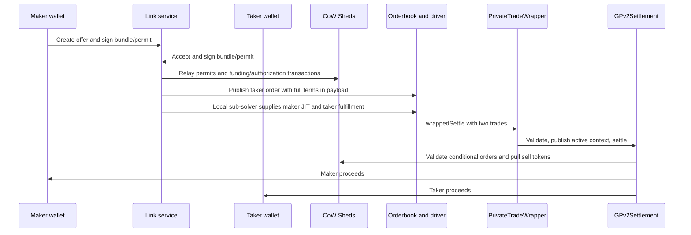

# Private trades assessment

Reviewed on 2026-09-14 against `e0069ce17f0bd4d9149309bccde6da592597d9ca`.

## Verdict

Continue the project as a focused ERC20 bilateral settlement product. Do not release this implementation with real funds yet. All four reproduced defects are now covered by passing regression tests: offers are single-use across appData hashes, each leg is checked against its own clearing prices, per-offer payloads cannot cross, and settlement requires order, receipt and consumed-state evidence. Cancellation, expiry, retry, recovery and restart are implemented and tested against the real service. What remains unproven is the browser and wallet surface, and no fresh end-to-end run against a real chain has been done for this revision.

The strongest product is a link that lets two known parties execute an agreed swap, inspect readable terms, cancel before execution, and recover cleanly from failure. CoW integration can provide distribution and familiar infrastructure. It does not automatically provide privacy, a business model, or permission to bypass auction rules.

This is a concept, implementation, and release review, not an external security audit. The accompanying artifacts assert the fixes; the limits that remain are listed at the end of each blocker rather than dropped.

## Recovered intent and resume point

The requested Pi session `01a091d9-6c68-72c8-b0bc-076186568301` was a read-only CoW Shed reconnaissance child. The full implementation continued in parent `01a091be-b691-71bb-b201-e55831b10b36`. Its last completed milestone was the browser-driven create, sign, share, accept, settle, and receipt flow at `e0069ce`.

The parent transcript establishes these decisions:

1. The original pasted RFC required exact ERC20 amounts, expiry, optional enforced counterparty restriction, links, atomic execution, and cancellation. It excluded a public orderbook and solver competition.
2. The user corrected an initial implementation based on an obsolete wrapper interface. The implementation moved to the documented `CowWrapper` Atomic Bundle framework.
3. After reiterating the no-orderbook premise, the user explicitly approved validating JIT plus fulfillment first. The current driver experiment was authorized. That approval does not prove that it satisfies the original privacy promise.
4. The user requested permits, direct wallet proceeds, and an on-chain beneficiary check. Those are implemented. The user also stated that nothing was in production and API changes were acceptable.
5. The last requested deliverable was the full app flow, with mobile explicitly excluded. Rabby compatibility and payload consistency were suggested next steps, not selected release requirements.

Evidence is in the project-local Pi parent transcript at lines 7, 194, 609, 626, 877, 1321, 1783, 1897, 1977, and 2078. The child transcript is under that session's `ffa9e5be-8903-4a85-8eee-7b161cb05105/run-0/session.jsonl`. Credentials and wallet payloads from the history are deliberately absent from this report.

## Concept and premises

The public [Private Trade Links proposal](https://forum.cow.fi/t/private-trade-links/3558) describes negotiated bilateral exchange rather than price discovery. That is a coherent, bounded use case. The current app is closest to a tool for known counterparties trading standard ERC20s on one EVM chain.

The concept is not technically novel merely because settlement is atomic. For example, [0x documents RFQ fills, taker restrictions, expiry, and cancellation](https://docs.0xprotocol.org/en/latest/basics/functions.html). The product must earn its complexity through a better agreement-to-settlement experience, CoW distribution, or useful integration into existing workflows. There is no demand, retention, or willingness-to-pay evidence in this repository. Commercial viability remains a hypothesis.

“Private” needs a precise definition. A restricted counterparty is an authorization property. Confidential pre-trade terms are a data-disclosure property. On-chain settlement exposes calldata and transfers. This code can enforce the former; its current orderbook route does not provide the latter.

The broader game-item premise needs revision. An EVM transaction cannot atomically transfer an item controlled by an unrelated off-chain game server without an additional custody or trusted coordination mechanism. ERC721 or ERC1155 assets also require a different transfer design from the present ERC20-only, interaction-free settlement. Those are separate products, not additional token entries.

“Gasless” means someone else pays. The current flow can involve two permit transactions, two Shed funding/authorization transactions, then settlement. Some steps disappear when allowances already exist. The historical 309,906-gas driver settlement cited in `JIT-PATH.md` excludes this complete setup cost and predates later changes. It is not a current total-cost benchmark.

Both orders set their minimum proceeds equal to the exact intended execution. That creates no order surplus to finance an ordinary surplus-funded route. A sustainable service needs explicit fees, sponsored gas, or an application subsidy, plus pricing for failed and abandoned attempts. As an illustration, a hypothetical 10-basis-point fee on $100 produces $0.10 before gas and operations. No profitability follows from a successful offline swap.

## What the implementation actually does

The orderbook, autopilot, driver, and custom solver participate in the implemented app path. The service does not call a BYOS proposal API. The optional `PrivateTradeSubmitter` provides a separate direct-submission path at contract level.

| Component | Responsibility | Assessment |
| --- | --- | --- |
| `PrivateTradeLib`, `PrivateTradeBuilder` | Derive orders, conditional authorizations, signatures and settlement encoding | Useful shared implementation, but appData is not fixed by the conditional authorization |
| `PrivateTradeWrapper`, `PrivateTradeOrder` | Enforce paired execution using temporary wrapper context and durable offer state | Replay and independent-price defects remediated locally; cancellation implemented through the owning Shed |
| CoW Shed, `PrivateTradeAuthoriser` | Owner-signed funding and authorization; enforce own-wallet beneficiary | Valuable protection on the generated bundle path; not a substitute for validating what arbitrary signed calls do |
| `LinkCompute`, `LinkRelay`, link service | Persist offers, compute signatures, relay and report progress | Per-offer artifacts, atomic offer records, explicit lifecycle states, cancellation and recovery; acceptance locking is per process, so a shared store still needs a single writer |
| Custom sub-solver and browser app | Produce JIT/fulfillment solutions and collect signatures | Demonstrated locally in prior session; not a completed production BYOS integration |

## Release blockers

### 1. Conditional authorization can execute again under a different appData hash

**Remediated locally.** `PrivateTradeOrder._orderFor` still derives the expected order from the current appData, but the wrapper now records successful execution by `offerId`, independently of appData and GPv2 order UID. The consumed transition occurs before the settlement call and rolls back if settlement fails.

The counterexample settles a pair, replenishes its balances and allowances, changes both orders' appData, and settles again with the same conditional authorizations. Both recipients receive twice the authorized trade amount across the two executions. It does not require another conditional-order authorization.

Preconditions matter: the repeated transfer requires available funds and allowance. The exact initial funding can temporarily prevent it, but subsequent trades can replenish both. The existing `test_replayReverts` only retries the identical order bytes.

Sources: `src/PrivateTradeWrapper.sol`, `src/PrivateTradeOrder.sol`, and `lib/cow-contracts/src/contracts/GPv2Settlement.sol`. Proof: `test/PrivateTradeSettlement.t.sol`, including changed-appData replay and failed-settlement rollback; `docs/review/ReviewCounterexamples.t.sol`.

Required outcome: one authorized offer cannot execute twice, even if appData changes, balances return, approvals are renewed, or another submitter encodes it. Consider explicit consumed-offer state and cancellation semantics, or a rigorously fixed order commitment. Do not rely on depleted allowances as replay protection.

### 2. Taker prices can consume existing settlement funds

**Remediated locally.** The driver-compatible token list still permits duplicate token addresses at different indices. `_validateSettlement` now checks the maker and taker independently using each trade's own indices, matching GPv2's execution equation.

The counterexample keeps maker execution exact, gives the taker separate token indices and a better price, seeds the settlement with 100 USDC, and completes successfully. The taker receives 200 USDC for an agreement specifying 100 USDC; the settlement's seeded 100 USDC is consumed.

This requires an authenticated submitting path and an existing settlement balance. It does not show that an arbitrary unauthenticated EOA can invoke the wrapper directly. It does refute the wrapper's exactness and buffer-isolation claims.

Sources: `src/PrivateTradeWrapper.sol`, `src/libraries/PrivateTradeLib.sol`, and `lib/cow-contracts/src/contracts/GPv2Settlement.sol`. Proof: `test_rejectsIndependentTakerPrices` and `test_takerIndependentPricesCannotSpendSettlementBuffer`.

Required outcome: validate actual executed output for each trade using its own prices, and prove that the pair cannot consume pre-existing protocol balances. Retain duplicate-index compatibility with the driver.

### 3. Relay uses the last computed offer instead of the accepted offer

**Remediated locally.** `LinkCompute`, `LinkRelay`, `LinkCancel` and `Withdraw` take their input and output paths from the environment, and every invocation gets a private directory it alone writes. The service's typed-data checks, development signing, probes and wallet diagnostics do the same. Offer records are written to a temporary file and renamed, so no reader sees a partial record, and the sub-solver's copy is published the same way.

Original finding, kept as the record of the review: `relay(computed, signatures)` never wrote `computed` to the file that `LinkRelay.run` reads. Creating offer B overwrote `out-json/link-computed.json`. Later acceptance of offer A wrote A's signatures, then invoked the relay against B's computation.

Signature checks usually turned this into a failure rather than unauthorized payment, but it made normal multi-offer use unreliable. It needed no simultaneous JavaScript execution: a sequential A-create, B-create, A-accept sequence was enough. Withdrawal computation had a similar globally shared plan file.

Proof: `docs/review/service-counterexamples.mjs` relays offer A while offer B is on disk. `docs/review/service-lifecycle.mjs` runs two service instances over one store and interleaves 48 signature checks; restoring the shared path fails that check with one instance reading another's typed data.

Required outcome, met for a single writer: immutable per-offer computed payloads and per-attempt files, with acceptance and withdrawal executing exactly the signed plan. Two instances sharing a store can still lose an update to one offer record; that needs a store-level lock or a single writer.

Sources: `link-service/server.mjs:121`, `:141`, `:160`; `script/LinkRelay.s.sol:34`.

### 4. A balance decrease is reported as settlement

**Remediated locally.** `status` no longer reads balances. `settled` requires all three of: the intended order is fulfilled, its settlement transaction has a successful receipt, and the wrapper reports the offer consumed. `settling` is returned while any of the three is missing, with each piece of evidence reported separately.

Original finding, kept as the record of the review: `status` reported `settled` whenever the maker Shed's sell-token balance dropped below its acceptance baseline. With an open order and no settlement transaction, an unrelated withdrawal produced a successful status, and the receipt could then say that a transaction was not found.

Proof: `docs/review/service-counterexamples.mjs`, plus the `settled requires a fulfilled order, a successful receipt, and consumed wrapper state` case in `docs/review/service-lifecycle.mjs`, which walks the four states through the real HTTP endpoint.

Required outcome, met: execution is derived from the intended order UID and successful transaction evidence, with explicit pending, cancelled, expired, failed and confirmation states. Balance changes no longer substitute for evidence. Chain finality remains a separate, unimplemented state.

Source: `link-service/server.mjs:462`.

### 5. Funding, retries, cancellation and open acceptance do not form a complete lifecycle

**Remediated locally for the supported path.** Cancellation exists end to end: the maker signs a bundle that removes its ComposableCoW authorization and marks the offer cancelled in the wrapper in one transaction, and `cancelOffer` refuses a maker mismatch and refuses to cancel a consumed offer. The relay skips a Shed whose bundle nonce is already spent before touching its permit, so a retry after partial funding converges. Acceptance records a phase, returns `recovery_available` with the reason when funding succeeds but publishing or posting fails, and refuses a second in-flight acceptance in the same process. Expiry is reported as `expired` rather than `open`. Open offers were removed: a concrete taker address is required, which is the first supported mode the finding recommended.

Original finding, kept as the record of the review: funding and settlement are different transactions, and `LinkRelay.run` performed permits before checking whether bundle nonces were consumed, so a retry after an EIP-2612-funded bundle spent its allowance failed the allowance check before reaching the nonce skip. An orderbook error after successful funding left exactly that recovery problem. An open offer was not implemented correctly either: `LinkCompute._terms` mapped a zero taker through `proxyOf(0)` rather than preserving the open-offer sentinel, and acceptance recomputed terms, expiry and salt while retaining the maker's old signature. There was no cancellation route or UI, despite cancellation being in the original MVP, and withdrawal was shown only after the UI decided a trade settled.

Proof: `test_makerCancellationAtomicallyRevokesOrderAndOffer` through a real CoW Shed bundle, `test_bundleNonceCannotBeReplayed`, and the lifecycle suite in `docs/review/service-lifecycle.mjs` covering duplicate and simultaneous acceptance, post-order failure with recovery, retry convergence, restart, expiry and cancellation.

Required outcome: met for a restricted offer driven by one service process. Open acceptance still needs its own authorization design before it can be enabled, and a multi-instance deployment needs a store-level acceptance lock.

## Additional material gaps

| Area | Finding | Required release evidence |
| --- | --- | --- |
| Confidentiality | Posted taker appData ABI-encodes both parties' terms, including beneficiary wallets. Its ERC-1271 payload also includes full terms. The maker has no separate orderbook entry, but its information is disclosed. Role reads trust an unsigned `address` query. | An explicit threat model and either a private submission path or accurate disclosure to users. See `LinkCompute.s.sol:278`, `PrivateTradeAppData.sol:49`, `server.mjs:554`. |
| Wallet and token support | The app always runs the permit-signing flow. When typed data is unavailable it uses `personal_sign` on a raw permit digest, which adds a different signing envelope. It has no functional approve transaction flow. DAI-style `allowed=true` grants an unlimited allowance, unlike the amount-limited UI description. Contract-owner signatures are restricted by local ECDSA/65-byte handling. | Named supported wallets and token contracts, real permit and approve-path tests, truthful allowance display, chain checks, and a deliberate smart-wallet/Safe story. See `page.mjs:423`, `TokenPermit.sol:97`, `server.mjs:655`. |
| Browser trust | Token symbols and error strings enter `innerHTML` templates without escaping. Arbitrary token metadata can therefore become markup on a signing page. `createChecked` validates the generated helper call; it cannot protect users who sign arbitrary malicious calls from a compromised page. | Render untrusted values as text, validate complete signing requests, and test malicious metadata. See `page.mjs:110`, `:245`, `:256`; `server.mjs:353`. |
| Service robustness | Synchronous Forge/RPC calls block the HTTP process, acceptance locking is per process rather than per store, and there is no durable job queue or bounded operational queue. Sub-solver solutions all use id `0`. Fixed since the review: offers use a 128-bit random bearer id, so repeated identical creation no longer overwrites a record; records and sub-solver files are written atomically; expiry is reported; and multi-offer and restart behaviour is tested. | Authenticated sensitive reads, bounded resource use and unique solution IDs. A store-level acceptance lock or a single writer is required before running two instances over one store. See `server.mjs:102`, `:624`; `subsolver/private-trade-solver.mjs:81`. |
| Release proof | The app browser test uses development wallets and tests one restricted pair. It checks received balances increased, not exact four-way deltas. CI runs Foundry only. Existing tests are useful but do not cover the reproduced defects. | Exact debit/credit assertions, extension-wallet runs, application regression tests, independent contract review, staging approval, and production configuration evidence. See `scripts/app-e2e.mjs`, `.github/workflows/test.yml`. |

## BYOS and primary-document assessment

The [Atomic Bundle integration guide](https://docs.cow.fi/cow-protocol/integrate/wrappers) supports this project's use of `CowWrapper`, deterministic `validateWrapperData`, staging testing, and eventual audit/DAO approval. The [contract reference](https://docs.cow.fi/cow-protocol/reference/contracts/periphery/wrapper) explicitly warns about untrusted settlement data and intermediate bundles. The last-wrapper check is a good response to that warning. Making the orders invalid outside the wrapper is also stronger than relying on a solver's promise to include it.

Those documents do not make a new bundle production-authorized. Tests impersonate an allowlist manager; that proves execution under test permissions, not staging or DAO approval. The upstream integration example still uses `target` for appData whereas this pinned backend uses `address`. Preserve the proven wire format and pin the compatible services/app-data revisions rather than copying the example blindly.

The [BYOS RFP](https://forum.cow.fi/t/rfp-bring-your-own-solver-byos/3469) concerns permissionless proposals to a bonded operator participating in ordinary CoW auctions. Its no-new-orderbook requirement means BYOS should not operate an additional discovery channel; it does not mean execution bypasses CoW's orderbook.

The adjacent local implementations confirm the integration gap. TypeScript `apps/byos/src/infra/api/solve.ts:216` builds Trampoline interactions and one fee-bearing fulfillment. The Rust equivalent at `crates/byos/src/infra/api/solve.rs:164` builds one fulfillment and no wrappers. The local docs and TypeScript schema are newer than the local Rust schema, so they must not be treated as one synchronized implementation. Reviewed snapshots were TypeScript `9fdfa03`, docs `c67f577`, and Rust `3f5d914`; their current deployed state was not checked.

`PrivateTradeProposal` is a custom proposed schema, not an integrated BYOS feature. Its signature is optional, it does not verify escrow eligibility, and the link path creates unsigned proposals. Its terms hash excludes beneficiaries and the full execution payload. On-chain validation of a successful pair does not establish fair blame for a malformed submission that reverts, and reverted attribution events do not survive. Revert attribution needs a separately specified verifiable record and policy.

The Rust validator at `infra/blockchain/validator.rs:166` rejects proposals whose surplus-based score does not exceed its minimum. A zero-surplus exact pair does not acquire a funding model by being encoded as JIT. The earlier “about one week” BYOS estimate was a historical guess made before full service review; it is not a supported delivery commitment.

## Viable implementation choices

| Direction | Fit | Main cost | Judgment |
| --- | --- | --- | --- |
| Private link service plus agreed direct CoW submission | Closest to no public orderbook/no competition; retain wrapper, handler, Shed and beneficiary work | Approved submitting identity, explicit fees, private transaction delivery policy, recovery and cancellation | Preferred target if the original product promise remains important. Whether BYOS operates it is a separate integration agreement. |
| Current maker-JIT/taker-fulfillment path | Proven driver experiment and useful compatibility test | Public terms, auction economics/policy, conditional-signature infrastructure settings, unfinished BYOS support | Retain as an integration test. Ship only with an explicitly changed product promise and a verified economic route. |
| Narrow bilateral swap contract or existing OTC settlement integration | Natural expression of a two-party exchange | Different audit/integration work and less CoW reuse | Benchmark for cost and complexity. Reusing GPv2 is a strategic choice, not a requirement for atomicity. |

My recommendation is to keep the useful contract structure, fix the invalid guarantees, and validate direct submission with the intended operator before expanding the app. Do not add a private route to BYOS merely because its key is allowlisted; settle ownership, fees, policy and liability first. Do not design new proposal schemas before deciding which BYOS implementation and runtime will own the feature.

## Verification performed

Recorded per revision, because "the tests pass" means different things before and after the fixes.

| Check | At review | After the fixes in this report | Limit |
| --- | --- | --- | --- |
| `forge test` | 51 passed, 0 failed, 2 skipped | 59 passed, 0 failed, 1 skipped | Fork and offline suites require configuration |
| `FORK_RPC=https://ethereum-rpc.publicnode.com forge test --match-path 'test/fork/*' -vv` | 5 passed | 5 passed | Local fork with funded accounts and impersonated allowlisting; no production writes |
| `forge fmt --check` | Passed | Passed | Formatting only |
| `node scripts/check-page.mjs` | Both generated page scripts parse | Both parse | No browser-wallet compatibility proof |
| `bash docs/review/run-counterexamples.sh` | Two contract regressions pass; two service counterexamples remain reproduced | Two contract regressions pass, three service counterexamples pass as regressions, and 9 lifecycle checks pass | Contract tests execute actual local GPv2 code. Service checks replace `forge`, `cast` and the orderbook at their boundaries and drive the real HTTP handler. |

The contract cases pass only when the exploit attempts revert and protocol balances remain isolated. The service cases now assert the fixed behaviour instead of reproducing the defect: `docs/review/service-counterexamples.mjs` pins per-offer artifacts, evidence-based settlement and the relay's use of the accepted offer, and `docs/review/service-lifecycle.mjs` drives interleaving, two instances over one store, restart, duplicate and simultaneous acceptance, post-order failure with recovery, expiry, cancellation and the settlement evidence chain over real HTTP. Each was checked against the pre-fix code and fails there. Run them with `bash docs/review/run-counterexamples.sh`. The runner copies source and tests into a temporary directory and broadcasts nothing.

The isolated counterexample build reports two unused-parameter warnings in `PrivateTradeBuilder.wrapperData`.

The offline orderbook and link service were not listening on ports 8080 and 9200, and Docker was not running, so the app and link-service e2e scripts were not re-run for this revision. That remains the largest unverified surface: no fresh browser run and no fresh end-to-end settlement against a real chain. The external Grok exploration lanes were unavailable and the configured Claude synthesis model returned an access/model error. Native agents recovered the transcript and checked documentation claims; this report does not claim a completed multi-provider security review.

The Prove It Works principle changed the review method: passing tests were followed by executable attempts to disprove the guarantees. It produced four concrete counterexamples instead of a readiness verdict based only on the prior agent's report, and the lifecycle suite is the same treatment applied to the fixes.

## Continuation and acceptance gates

1. ~~Complete cancellation around the new offer lifecycle state, then make service plans immutable per offer and replace balance-only settlement inference with order and receipt evidence.~~ Met. See blockers 3, 4 and 5.
2. ~~Make signed payloads immutable per offer and implement durable lifecycle/recovery. Test two interleaved offers, consumed permit retries, post-order timeouts, concurrent acceptance, restart, cancellation and expiry. Settlement must require exact order/transaction evidence.~~ Met for one service process over one store, tested by `docs/review/service-lifecycle.mjs`. A store-level acceptance lock remains open for a multi-instance deployment.
3. Agree the production submission contract with CoW/BYOS. Document privacy, operator identity, fee payer, signature admission, scoring, attribution, supported infrastructure flags and staging allowlisting. Demonstrate one pair on that actual path before claiming BYOS support.
4. Finish a restricted ERC20 desktop beta. Use named standard tokens, readable decimal inputs, safe metadata rendering, real wallet signing, a working approval fallback, cancellation and recovery. Prove exact wallet debits/credits and no residual unexpected funds. Open acceptance requires its own proof before enabling it.
5. Obtain independent audit/remediation and staging evidence, measure the complete transaction cost, and test demand with intended users. Production approval and operations follow those results. Mobile, NFTs and off-chain game items remain outside this release.

Next engineering action: start gate 4 on the contract side — render untrusted token metadata as text, gate signing on chain and account, and report the allowance a permit actually grants — then re-run the app and link-service e2e against the offline stack, which is the only remaining evidence this revision has not reproduced.
